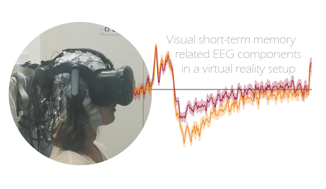

<h2>Visual short-term memory related EEG components in a virtual reality setup</h2>
Code base of: <a href="https://www.biorxiv.org/content/10.1101/2023.01.23.525140v1"> Klotzsche, Gaebler, Villringer, Sommer, Nikulin, & Ohl. <i>bioRxiv</i>, 2023</a><br>  
<br/><br/>
  
[](#)
[](#)
[](#)

<h2>Introduction</h2>

Combining EEG with virtual reality, we studied how the eccentricity of a memory array during encoding affects well-known neural markers of visual short-term memory. We reveal that previously reported EEG-markers of visual memory can be replicated in such a setup. These EEG-markers were differently affected by eccentricity, hence providing valuable constraints for future experimental designs.


<h2>Instructions</h2>

If you want to reproduce the statistics (or the [pre]processing steps) reported in the paper, we suggest that you follow these steps: 

> **tl;dr**  
Code relevant for the EEG (pre)processing can be found in the `.ipynb` notebooks in [Analyses_Py/Pipeline_clean](Analyses_Py/Pipeline_clean).  
Most of the statistical analysis are performed in [Analyses_R/VME_mainAnalysis.Rmd](Analyses_R/VME_mainAnalysis.Rmd).  
The code for the eye tracking analysis is in [Analyses_R/EyeTracking/analyze_gaze.R](Analyses_R/EyeTracking/analyze_gaze.R).  

> **Most important:** 
If you run into problems, please do not hesitate to contact me (e.g., via email) or open an issue here. Much of the code is acceptably well documented and the notebooks should (theoretically) run from top to bottom but it probably is not 100% self-explanatory.  
So if you want to work with the code, I am happy to support you in getting it to work.
  
**How to get started:**   
1. Download the data set from [Edmond – The Open Research Data Repository of the Max Planck Society](https://edmond.mpdl.mpg.de/dataset.xhtml?persistentId=doi:10.17617/3.WRDUGO)  
    There are data-readme files on Edmond which explain which files you might want to work with (the entire data set is quite spacious).
2. Clone this repository to a clean local directory (called `ROOT` in the next sections). 
3. `Recommended:` Set up a dedicated virtual environment (e.g., via conda). I provide a `requirements.txt` in the repository which reflects the conda environemnt I was working in. This, however, is quite extensive and includes more than needed. You _can_ try to create a new conda environment from this file (if you have time and like fighting with conda). I would recommend starting out with a minimal environment (based on `Python 3.9+`), manually [install MNE-Python](https://mne.tools/stable/install/manual_install.html#manual-install), and install furher required packages on the fly (i.e., when you need them).
4. Activate your new environment and change into your `ROOT`:
    ```
    conda acitvate <your_env_name>
    cd path\to\ROOT
    ```
4. Add the python module in the repo to the conda environment:  
    ```
    conda develop vMemEcc-Analyses/Analyses_Py
    ```
   **or** via pip (if you don't work with conda):
    ```
    pip install -e vMemEcc-Analyses/Analyses_Py
    ```
5. Now, in order to make it easier to put the data in the right place, I recommend importing [`config.py`](Analyses_Py/library/config.py) once. It will initialize the `Data` folder structure:
    ```
    python3.10 -c "from library import config"
    ```
    Alternatively, you can run the top cell in one of the `.ipynb` notebooks, which will do the same.
7. in `ROOT` you should now find a folder `Data` which contains a bunch of nested empty subfolders. 
    * If you downloaded the data folder `VME_EEG` from [Edmond](https://edmond.mpdl.mpg.de/dataset.xhtml?persistentId=doi:10.17617/3.WRDUGO) you will in it find the same structure. The subfolder `DataMNE` has to be placed directly into `ROOT\Data` and the downstream structure must stay intact if you want to work with the scripts in this repo (without having to tweak 1000 paths).  
    * If you want to work with the raw data (in the zip-folder `VME_RawFiles.zip` on [Edmond](https://edmond.mpdl.mpg.de/dataset.xhtml?persistentId=doi:10.17617/3.WRDUGO), you need to place the folders with all the single subject files (`VME_S23`, etc) in a folder `ROOT\Data\SubjectData`. Do not forget that some of the subfolders are separately zipped. 
    * If you want to work in R, the data from `VME_DataR` needs to be placed next to `DataMNE` (i.e., in `ROOT\Data\`). 
8. Now you should be ready to go. 😊


<h2>Versions</h2>

###### version 1.0
`2023-01`: Code associated with the preprint:
* <a href="https://www.biorxiv.org/content/10.1101/2023.01.23.525140v1"> Klotzsche, Gaebler, Villringer, Sommer, Nikulin, & Ohl <i>bioRxiv</i>, 2023</a>

<h2>Contributors</h2>
<a href="https://github.com/eioe">Felix Klotzsche</a><br>
<a href="https://svenohl.wordpress.com/">Sven Ohl</a>
