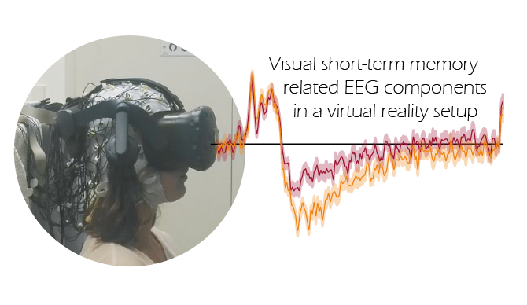

<h2>Visual short-term memory related EEG components in a virtual reality setup</h2>
Code base of: <a href="https://elifesciences.org/articles/64812"> Klotzsche, Gaebler, Villringer, Sommer, Nikulin, & Ohl. <i>bioarXiv</i>, 2023</a> 

<h2>Introduction</h2>

Combining EEG with virtual reality, we studied how the eccentricity of a memory array during encoding affects well-known neural markers of visual short-term memory. We reveal that previously reported EEG-markers of visual memory can be replicated in such a setup. These EEG-markers were differently affected by eccentricity, hence providing valuable constraints for future experimental designs.

<h2>Methods</h2>

<h3>Versions</h3>

###### version 1.0
`2023-01`: Code associated with the preprint:
* <a href="https://ieeexplore.ieee.org/document/8613645"> Hofmann, Klotzsche, Mariola, Nikulin, Villringer, & Gaebler. <i>IEEE AIVR</i>, 2018</a>

<h3>Contributors</h3>
<a href="https://github.com/eioe">Felix Klotzsche</a> 
<a href="https://svenohl.wordpress.com/">Sven Ohl</a>